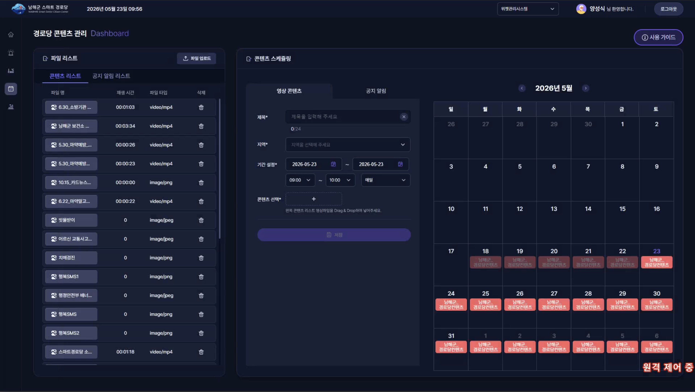
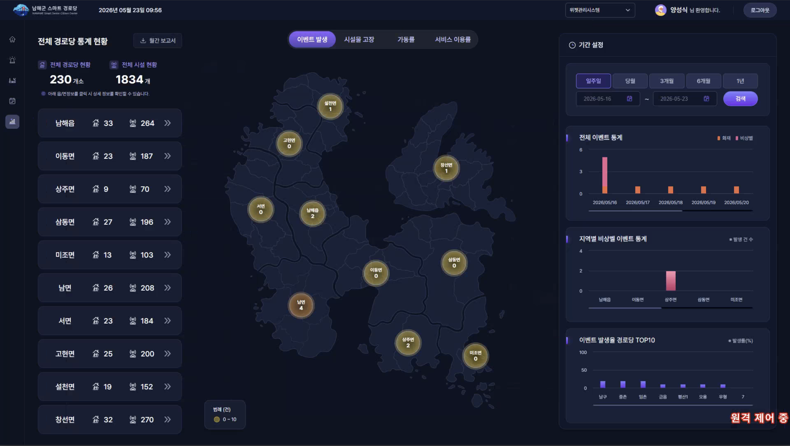

# 남해군 스마트 경로당 통합관제 플랫폼 (SSC)

> **한 줄 소개**  
> 남해군 **230개소 경로당, 약 1,800여 개 시설물을 실시간으로 모니터링**하는 GIS 기반 통합관제 대시보드. 화재·비상벨 같은 위급 상황을 즉시 감지하고, **비상벨 발생 시 자동으로 화상회의를 개설**해 현장 대응까지 이어지는 종합 플랫폼입니다.

---

## 🏆 성과

- **TTA 소프트웨어 품질인증(GS인증) 획득**
- **경남일보·보안뉴스 등 다수 언론 보도**
- 남해군에 정식 도입되어 운영 중 (2023 ~ 현재)

---

## 🎯 무엇을 위한 시스템인가요?

남해군 곳곳의 경로당은 어르신들이 주로 이용하시는 공간이라 **화재·낙상·응급상황 같은 위급한 일이 발생했을 때 빠른 대응이 매우 중요**합니다.  
이 시스템은 경로당에 설치된 화재 감지기·비상벨·CCTV·방송장비 등 **수많은 시설물을 한 화면에서 모니터링**하고, 비상 상황 발생 시 **운영자가 즉시 화상회의로 현장을 확인**할 수 있게 해줍니다. 동시에 경로당에 설치된 **32인치 모니터로 어르신들께 재난 정보와 마을 행사 소식을 안내**합니다.

---

## 🖥️ 화면 구성

`react-router-dom`으로 **3개의 사용자 그룹**을 위한 화면을 분기합니다.

| 경로 | 화면 | 사용자 |
|---|---|---|
| `/sc/mng` | **관제 대시보드** | 군청·소방서 관제 운영자 (권한별: ADMIN / FIRE / SENIOR) |
| `/sc/social/*` | **경로당 32인치 모니터** | 경로당 이용 어르신 |
| `/sc/noti/*` | **비상 알림 화면** | 알림 표출 전용 |

### 관제 대시보드 (`/sc/mng`) 내부 구성

권한에 따라 보이는 화면이 다르며, 다음 페이지들로 구성됩니다:

- **홈** — 전체 현황 요약 (지도 + 패널)
- **이벤트** — 발생한 이벤트 목록·처리
- **시설물** — 경로당별 시설물 관리
- **화재** — 화재 전용 관제 화면
- **일정** — 경로당 일정·행사 관리
- **통계** — 발생 이벤트 통계 차트 + 지도 기반 히트맵

---

## 🛠️ 주요 기능


### 0. 남해군 전반의 경로당 이벤트와 시설물 상태를 확인


### 1. 실시간 이벤트 알림 및 관제 (화재 · 비상벨)


- **화재·비상벨 이벤트 발생 시 실시간 알림** (WebSocket 기반)
- 지도 위에 발생 위치 즉시 표출, 토스트 알림 + 사운드
- **비상벨일 경우 화상회의 자동 개설** — 운영자가 현장을 즉시 확인·대응
- 권한별(ADMIN/FIRE/SENIOR) 분기된 관제 화면

### 2. 경로당별 시설물 관리

- 230개소 경로당, **약 1,800여 개 시설물** (화재 감지기·비상벨·CCTV·방송장비·신호등 등)을 통합 관리
- 시설물 등록·수정·상태 모니터링
- 지도 기반 시설물 위치 확인 (Leaflet + 마커 클러스터링)

### 3. 경로당 32인치 모니터 — 재난·행사 알림
** 미디어 표출 스케쥴 등록 **



** 실제 미디어 표출 화면 **

- 각 경로당에 설치된 **32인치 모니터에서 표출되는 전용 화면**
- 군청에서 등록한 **재난 정보·마을 행사·보도자료** 자동 표출
- **유튜브 영상·사진** 등 미디어 콘텐츠 슬라이드
- 화재 발생 시 해당 경로당 모니터에 **즉시 경고 알림 송출**

### 4. 이벤트 통계 + 지도 기반 시각화

- 발생 이벤트를 **Highcharts 차트**로 시각화 (유형별·시간대별·지역별)
- **Leaflet 히트맵**으로 사고 발생 빈도가 높은 지역 시각화
- 기간별 검색·필터·이력 조회

---

## 🧱 사용한 기술

| 영역 | 기술 |
|---|---|
| 백엔드 언어/프레임워크 | Java 1.8, Spring Boot 2.4 |
| 백엔드 라이브러리 | Spring Data JPA, **QueryDSL**, **Spring WebSocket**, **Netty**(외부 IoT 소켓), Swagger, Lombok |
| 데이터베이스 | **PostgreSQL** (다중 DB: 메인 / 방송 / SMS) |
| 외부 연동 | **YouTube Data API** (영상 콘텐츠), CAP 재난 알림 소켓, 외부 IoT 시설 시스템 |
| 프론트 언어/프레임워크 | React 18, TypeScript |
| 빌드 도구 | **Vite** |
| 상태관리 | **Zustand** + **React Query (TanStack Query)** |
| 지도(GIS) | Leaflet + react-leaflet + **MarkerCluster** + **Heatmap** + leaflet-draw / measure / geometryutil |
| 차트 | Highcharts 11 |
| UI | Styled Components, **React DnD** (드래그 앤 드롭) |
| 실시간 통신 | WebSocket (Notice / Facility / Social / Video / TV / Event 등 **6종 분리**) |
| 인프라 | Linux, **Docker Compose**, **Prometheus** (모니터링) |
| 아키텍처 패턴 | **CQRS** (presentation / application / domain / infrastructure 4계층 분리) |

---

## 📂 전체 폴더 구조

```
namhae-ssc/
├── src/main/java/com/eseict/ssc/        # 백엔드 (Spring Boot)
│   ├── monitoring/    ⭐ 이벤트 모니터링 (CQRS 패턴 적용)
│   │   ├── presentation/   — EventController
│   │   ├── application/    — Query / Command 서비스 분리
│   │   ├── domain/         — VO·엔티티 (EventCode, EventType, ZoneCode 등)
│   │   └── infrastructure/ — Repository 어댑터
│   ├── fire/          — 화재 관제
│   ├── facility/      — 시설물 관리 (CQRS)
│   ├── user/          — 사용자·권한 관리 (CQRS)
│   ├── conf/          — 화상회의
│   ├── sms/           — SMS 발송
│   ├── stat/          — 이벤트 통계
│   ├── schedule/      — 일정 관리
│   ├── signalLight/   — 신호등 관제
│   ├── open/          — Open API (외부 노출용)
│   ├── common/        — 공통 (주소·헬스체크 등)
│   ├── socket/        ⭐ 외부 시스템 소켓 통신
│   │   ├── cap/alert/      — CAP 재난 알림 수신
│   │   └── rinoEvent/      — Netty 기반 외부 IoT 시설 시스템 연동
│   ├── websocket/     ⭐ 클라이언트로 push (6종 분리)
│   ├── config/        — 다중 DB·6종 WebSocket·앱 설정
│   ├── repository/    — JPA Repository 모음
│   ├── scheduler/     — 배치/주기 작업
│   └── interceptor/   — 로그인 인터셉터
│
├── front/                                # 프론트엔드 (React 18 + Vite)
│   └── src/component/
│       ├── router.tsx              ⭐ 3개 화면 라우팅
│       ├── pages/
│       │   ├── manage/             ⭐ 관제 대시보드 (/sc/mng)
│       │   │   ├── ManageRoot.tsx       — 권한별 화면 분기 진입점
│       │   │   ├── home/                — 홈 (요약 화면)
│       │   │   ├── event/               — 이벤트 관제
│       │   │   ├── fac/                 — 시설물 관리
│       │   │   ├── fire/                — 화재 전용 관제
│       │   │   ├── sche/                — 일정 관리
│       │   │   ├── stat/                — 통계 차트
│       │   │   ├── _gis/                — 공통 GIS 컴포넌트 (CCTV 전체화면 등)
│       │   │   └── common/              — 상단바·네비바
│       │   ├── social/             ⭐ 경로당 32인치 모니터 (/sc/social/*)
│       │   │   ├── SocialRoot.tsx       — 경로당 모니터 진입점
│       │   │   ├── body/                — 사진·영상 슬라이드
│       │   │   ├── alarm/               — 화재 경고 알림
│       │   │   └── popup/               — 행사·보도자료 팝업
│       │   └── noti/               — 비상 알림 화면 (/sc/noti/*)
│       ├── stores/                 ⭐ Zustand 상태 저장소 (도메인별 12개)
│       ├── api/                    — 백엔드 API 호출 (axios)
│       ├── _hooks/                 — 커스텀 훅 (권한·CCTV·시설물 초기화 등)
│       ├── constants/              — 상수 (권한·메뉴·이벤트 코드)
│       └── types/                  — TypeScript 타입 정의
│
├── docker-compose.yml — 컨테이너 오케스트레이션
├── prometheus.yml     — Prometheus 모니터링 설정
├── pom.xml            — Maven
└── README.md          — 이 문서
```

> ⭐ 표시: 코드를 처음 볼 때 가장 먼저 열어보면 좋은 곳

---

## 🗺️ 기능 → 코드 위치 매핑

**파일/폴더명을 클릭하면 GitHub에서 바로 해당 위치로 이동합니다.**

### 백엔드 (서버)

| 기능 | 어떤 역할을 하는지 | 핵심 파일 |
|---|---|---|
| **이벤트 모니터링 API** | 화재·비상벨 등 발생한 이벤트 조회·등록·처리 (CQRS 패턴) | [monitoring/presentation/EventController.java](src/main/java/com/eseict/ssc/monitoring/presentation/EventController.java) |
| 이벤트 조회 로직 | 이벤트 조회·통계·히트맵 데이터 가공 | [monitoring/application/service/EventQueryService.java](src/main/java/com/eseict/ssc/monitoring/application/service/EventQueryService.java) |
| 이벤트 명령 로직 | 이벤트 발생·처리 완료·상태 변경 | [monitoring/application/service/EventCommandService.java](src/main/java/com/eseict/ssc/monitoring/application/service/EventCommandService.java) |
| 이벤트 WebSocket 송출 | 발생 이벤트를 관제 화면에 실시간 push | [monitoring/application/service/EventSocketService.java](src/main/java/com/eseict/ssc/monitoring/application/service/EventSocketService.java) |
| **화재 관제 API** | 화재 이벤트 전용 처리 | [fire/presentation/FireController.java](src/main/java/com/eseict/ssc/fire/presentation/FireController.java) |
| **시설물 관리 API** | 경로당별 시설물(화재기·비상벨·CCTV 등) 등록·조회·수정 | [facility/presentation/](src/main/java/com/eseict/ssc/facility/presentation) |
| 사용자·권한 API | 사용자 로그인·권한(ADMIN/FIRE/SENIOR) 관리 | [user/presentation/UserController.java](src/main/java/com/eseict/ssc/user/presentation/UserController.java) |
| **화상회의 API** | 비상벨 발생 시 화상회의 자동 개설 | [conf/presentation/](src/main/java/com/eseict/ssc/conf/presentation) |
| SMS 발송 | 비상 시 담당자에게 문자 알림 | [sms/presentation/](src/main/java/com/eseict/ssc/sms/presentation) |
| **이벤트 통계 API** | 유형별·시간대별·지역별 통계 차트 데이터 | [stat/presentation/](src/main/java/com/eseict/ssc/stat/presentation) |
| 일정·행사 관리 API | 경로당 일정·노티스케줄 등록·조회 | [schedule/presentation/](src/main/java/com/eseict/ssc/schedule/presentation) |
| 신호등 관제 API | 신호등 시설물 상태 관리 | [signalLight/presentation/](src/main/java/com/eseict/ssc/signalLight/presentation) |
| Open API | 외부 시스템에 노출하는 공개 API | [open/presentation/](src/main/java/com/eseict/ssc/open/presentation) |
| **CAP 재난 알림 수신** | 정부 재난 경보 시스템(CAP)에서 알림 수신 | [socket/cap/alert/](src/main/java/com/eseict/ssc/socket/cap/alert) |
| **외부 IoT 시설 소켓** | Netty 기반 외부 시설 시스템과 실시간 TCP 연동 | [socket/rinoEvent/](src/main/java/com/eseict/ssc/socket/rinoEvent) |
| **WebSocket 설정 (6종)** | Notice/Facility/Social/Video/TV/Event WebSocket 분리 구성 | [config/websocket/](src/main/java/com/eseict/ssc/config/websocket) |
| **다중 DB 연결 설정** | 메인 / 방송 / SMS 3개 DB 동시 연결 | [config/dataConfig/](src/main/java/com/eseict/ssc/config/dataConfig) |
| QueryDSL 설정 | 복잡한 동적 쿼리를 위한 QueryDSL 구성 | [config/dataConfig/dsl/QueryDslConfig.java](src/main/java/com/eseict/ssc/config/dataConfig/dsl/QueryDslConfig.java) |
| 로그인 인터셉터 | 모든 API 요청 권한 확인 | [interceptor/LoginInterceptor.java](src/main/java/com/eseict/ssc/interceptor/LoginInterceptor.java) |
| 배치/스케줄 작업 | 주기적 데이터 갱신·정리 작업 | [scheduler/](src/main/java/com/eseict/ssc/scheduler) |

### 프론트엔드 (화면)

| 화면/기능 | 어떤 역할을 하는지 | 핵심 폴더·파일 |
|---|---|---|
| **앱 라우팅** | 관제/경로당 모니터/알림 3개 화면으로 분기 | [router.tsx](front/src/component/router.tsx) |
| **관제 대시보드 진입점** | 권한(ADMIN/FIRE/SENIOR)에 따라 화면 분기 + 초기 데이터 로드 | [pages/manage/ManageRoot.tsx](front/src/component/pages/manage/ManageRoot.tsx) |
| └ 홈 화면 | 전체 현황 요약 (지도 + 통계 패널) | [manage/home/](front/src/component/pages/manage/home) |
| └ **이벤트 관제** | 발생 이벤트 실시간 표출, 토스트 알림 | [manage/event/](front/src/component/pages/manage/event) |
| └ **시설물 관리** | 경로당별 시설물 등록·조회·수정 | [manage/fac/](front/src/component/pages/manage/fac) |
| └ **화재 전용 관제** | 화재 이벤트 집중 관제 (소방서 권한용) | [manage/fire/](front/src/component/pages/manage/fire) |
| └ 일정 관리 | 경로당 일정·행사 캘린더 | [manage/sche/](front/src/component/pages/manage/sche) |
| └ **통계 차트** | Highcharts 차트 + Leaflet 히트맵으로 이벤트 통계 시각화 | [manage/stat/](front/src/component/pages/manage/stat) |
| └ **CCTV 전체화면 모달** | 어디서든 CCTV 영상을 전체화면으로 표출 | [manage/_gis/FullCctvBox.tsx](front/src/component/pages/manage/_gis/FullCctvBox.tsx) |
| └ 공통 GIS 컴포넌트 | 여러 화면에서 공유하는 Leaflet 지도 베이스 | [manage/_gis/GisBase.tsx](front/src/component/pages/manage/_gis/GisBase.tsx) |
| **경로당 32인치 모니터 진입점** | 경로당에 설치된 모니터에서 표출되는 전용 화면 | [pages/social/SocialRoot.tsx](front/src/component/pages/social/SocialRoot.tsx) |
| └ **사진·영상 슬라이드** | 유튜브 영상·홍보 사진 자동 재생 | [social/body/](front/src/component/pages/social/body) |
| └ **화재 경고 알림** | 화재 발생 시 경로당 모니터에 즉시 경고 표출 | [social/alarm/](front/src/component/pages/social/alarm) |
| └ 행사·보도자료 팝업 | 군청 등록 행사·보도자료 자동 표시 | [social/popup/](front/src/component/pages/social/popup) |
| **비상 알림 화면** | 비상 상황 전용 알림 화면 | [pages/noti/NotiRoot.tsx](front/src/component/pages/noti/NotiRoot.tsx) |
| **Zustand Stores** | 도메인별로 분리된 12개 상태 저장소 (common/event/fac/fire/gis/home/sche/social/stat/conf/file 등) | [stores/](front/src/component/stores) |
| **API 호출 모음** | axios + React Query 기반 백엔드 API 호출 | [api/](front/src/component/api) |
| **공통 초기화 훅** | 권한·CCTV·시설물 등 앱 시작 시 1회 로드 | [_hooks/](front/src/component/_hooks) |

---

## 🔍 처음 코드를 보는 분께 — 추천 탐색 순서

1. **[router.tsx](front/src/component/router.tsx)** — 3개 화면(관제/경로당 모니터/알림) 분기 확인
2. **[ManageRoot.tsx](front/src/component/pages/manage/ManageRoot.tsx)** — 관제 대시보드가 권한별로 어떻게 분기되는지
3. **[SocialRoot.tsx](front/src/component/pages/social/SocialRoot.tsx)** — 경로당 32인치 모니터 화면이 어떻게 구성되는지
4. **[monitoring/presentation/EventController.java](src/main/java/com/eseict/ssc/monitoring/presentation/EventController.java)** — 이벤트 처리의 핵심 API (CQRS 패턴 적용)
5. **[config/websocket/](src/main/java/com/eseict/ssc/config/websocket)** — 6종 WebSocket이 어떻게 분리·구성되어 있는지
6. **[socket/rinoEvent/](src/main/java/com/eseict/ssc/socket/rinoEvent)** — Netty 기반 외부 IoT 시설 시스템과 어떻게 연동되는지
7. 관심 있는 기능이 보이면, 위의 **"기능 → 코드 위치 매핑"** 표에서 해당 폴더로 이동
